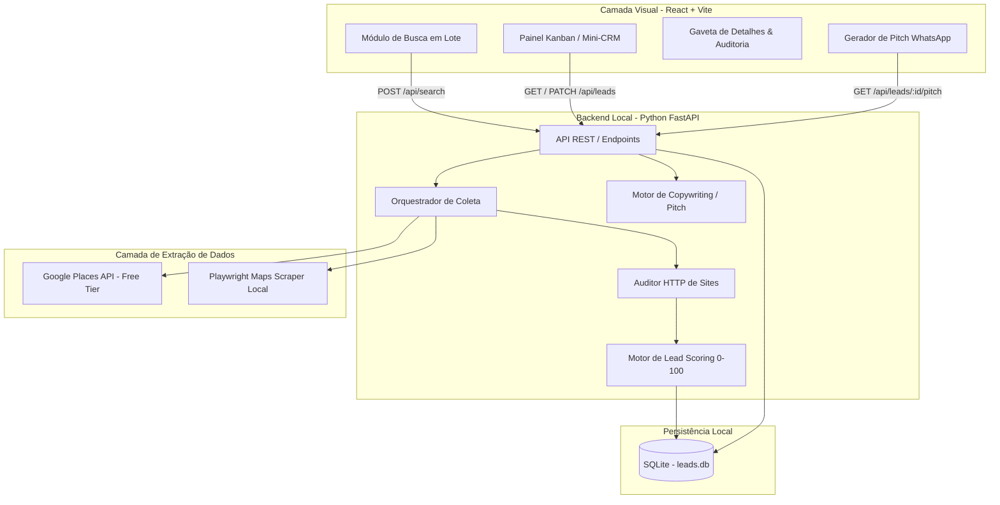
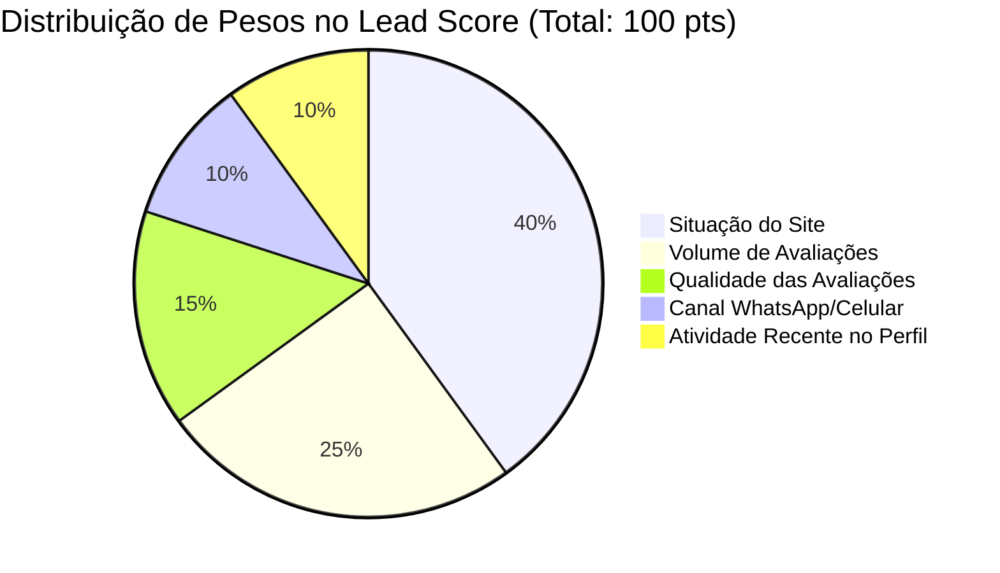

# Blueprint Arquitetural e Funcional: BucaLeads

Este documento consolida todas as especificações técnicas, regras de negócio e o roadmap de implementação da plataforma **BucaLeads**, projetada para prospecção ativa de empresas no Google, auditoria de presença digital, pontuação preditiva de leads (*Lead Scoring*) e gestão de funil (Mini-CRM).

---

## 1. Visão Geral da Arquitetura

O sistema adota uma arquitetura em camadas desacopladas. O **Frontend** opera como uma SPA (Single Page Application) estática, o que permite rodar 100% localmente agora e ser publicado no **Cloudflare Pages** sem alterações na estrutura de código. O **Backend** atua como motor local de coleta, auditoria e persistência.



---

## 2. Modelo de Dados (SQLite Schema)

O banco de dados local `leads.db` será estruturado para garantir rastreabilidade completa da origem do dado e auditoria do lead:

```sql
-- Tabela de Histórico de Buscas
CREATE TABLE IF NOT EXISTS searches (
    id TEXT PRIMARY KEY,
    query TEXT NOT NULL,              -- Ex: "Clínica Odontológica em Curitiba"
    niche TEXT NOT NULL,
    location TEXT NOT NULL,
    total_found INTEGER DEFAULT 0,
    created_at TIMESTAMP DEFAULT CURRENT_TIMESTAMP
);

-- Tabela Principal de Leads
CREATE TABLE IF NOT EXISTS leads (
    id TEXT PRIMARY KEY,
    search_id TEXT,
    business_name TEXT NOT NULL,
    niche TEXT NOT NULL,
    address TEXT,
    city TEXT,
    state TEXT,
    phone TEXT,
    phone_type TEXT,                  -- 'mobile', 'landline', 'unknown'
    website TEXT,
    website_status TEXT,              -- 'none', 'social_media', 'insecure', 'outdated', 'healthy'
    rating REAL DEFAULT 0.0,
    review_count INTEGER DEFAULT 0,
    has_recent_activity BOOLEAN DEFAULT 0,
    source TEXT NOT NULL,             -- 'google_places_api' OU 'local_scraper'
    lead_score INTEGER DEFAULT 0,     -- 0 a 100
    score_tier TEXT,                  -- 'hot' (>=85), 'warm' (60-84), 'cold' (<60)
    score_breakdown JSON,             -- Detalhamento de cada ponto ganho
    crm_status TEXT DEFAULT 'new',    -- 'new', 'contacted', 'in_conversation', 'proposal_sent', 'won', 'lost'
    notes TEXT,
    created_at TIMESTAMP DEFAULT CURRENT_TIMESTAMP,
    updated_at TIMESTAMP DEFAULT CURRENT_TIMESTAMP,
    FOREIGN KEY(search_id) REFERENCES searches(id)
);

-- Tabela de Auditoria Técnica do Site
CREATE TABLE IF NOT EXISTS site_audits (
    id TEXT PRIMARY KEY,
    lead_id TEXT NOT NULL,
    url_tested TEXT,
    is_accessible BOOLEAN,
    is_https BOOLEAN,
    is_mobile_responsive BOOLEAN,
    response_time_ms INTEGER,
    redirects_to_social BOOLEAN,
    social_network TEXT,              -- 'instagram', 'facebook', etc.
    audited_at TIMESTAMP DEFAULT CURRENT_TIMESTAMP,
    FOREIGN KEY(lead_id) REFERENCES leads(id)
);
```

---

## 3. Especificação do Motor de Coleta & Auditoria

### 3.1 Coleta Híbrida Inteligente
* **Prioridade 1:** Google Places API (caso o usuário informe uma API Key nas configurações). O consumo é contabilizado e interrompido antes do término da cota gratuita.
* **Prioridade 2 / Fallback:** Playwright Headless local navegando no Google Maps. 
  * Estratégia anti-bloqueio: Delays randômicos entre ações (1.5s a 3.5s), *user-agents* reais atualizados e rolagem suave de página.
* **Identificador Visual:** Cada registro recebe a flag `source` para exibir badges visuais no painel (`[API]` em azul ou `[Scraper]` em roxo).

### 3.2 Inspetor Leve de Sites (*Site Inspector*)
Se um site for retornado na busca, o motor dispara uma verificação HTTP assíncrona:
1. **Detecção de Rede Social:** Compara o domínio contra *patterns* de redes sociais (`instagram.com`, `facebook.com`, `linktr.ee`, etc.).
2. **Checagem de Protocolo:** Testa conexão via HTTPS estrito; captura alertas de certificado inválido.
3. **Viewport & Mobile:** Verifica presença da meta tag `<meta name="viewport" content="...">` e tamanho de layout básico.
4. **Latência de Resposta:** Mede o tempo até o primeiro byte (TTFB) e tempo total de carregamento do HTML.

---

## 4. Matriz de Lead Scoring (0 a 100)



* **Situação do Site (Máx: 40 pts):**
  * Sem site: `+40 pts`
  * Link para Rede Social: `+35 pts`
  * Site fora do ar ou sem HTTPS: `+30 pts`
  * Site lento (>4s) ou sem meta viewport mobile: `+20 pts`
  * Site moderno e saudável: `+0 pts`
* **Volume de Avaliações (Máx: 25 pts):**
  * `> 200` avaliações: `+25 pts`
  * `50` a `200` avaliações: `+15 pts`
  * `< 50` avaliações: `+5 pts`
* **Qualidade / Estrelas (Máx: 15 pts):**
  * Nota `>= 4.5`: `+15 pts`
  * Nota `4.0` a `4.4`: `+10 pts`
  * Nota `< 4.0`: `+5 pts`
* **Canal Direto (Máx: 10 pts):**
  * Número identificado como celular (DDD + 9 dígitos no padrão BR): `+10 pts`
  * Telefone fixo: `+3 pts`
* **Atividade Recente (Máx: 10 pts):**
  * Respostas do proprietário nos últimos 60 dias: `+10 pts`

---

## 5. Motor de Pitch de Vendas (Offline com Interface para IA)

O gerador de pitch utiliza o padrão de projeto *Strategy/Adapter*. Inicialmente, executará via templates com preenchimento inteligente de variáveis; no futuro, poderá alternar para um provedor externo (Google Gemini Free API) sem alterar o restante do código.

### Templates Offline Dinâmicos

* **Cenário 1: Empresa sem site e com alta reputação**
  > *"Olá, time da {{business_name}}! Tudo bem? Meu nome é Lucas. Estava pesquisando por {{niche}} em {{city}} e encontrei o perfil de vocês no Google com uma reputação incrível: são {{review_count}} avaliações e nota {{rating}}, parabéns! Notei, porém, que vocês ainda não possuem um site oficial registrado no perfil. Muitos clientes que pesquisam pelo Google preferem conferir serviços e agendar online antes de ligar. Vocês já pensaram em ter uma página própria para converter essas buscas em clientes diretos?"*

* **Cenário 2: Empresa usando Instagram como site**
  > *"Olá, pessoal da {{business_name}}! Parabéns pelo trabalho em {{city}}, vi a excelente nota de {{rating}} estrelas no Google. Notei que o botão de site de vocês redireciona direto para o Instagram. Ter um site próprio profissional ajuda a posicionar no topo das pesquisas locais e permite ter botões rápidos de agendamento e cardápio sem depender do algoritmo do Instagram. Gostariam de ver uma prévia de como ficaria um site moderno para vocês?"*

* **Cenário 3: Site sem segurança (HTTP) ou não adaptado para celular**
  > *"Olá! Estava navegando no perfil da {{business_name}} e tentei acessar o site de vocês pelo celular, mas notei que a página não está adaptada para telas móveis (além de acusar site não seguro pelo navegador). Como mais de 80% dos clientes buscam pelo smartphone, isso pode estar fazendo vocês perderem clientes para a concorrência. Posso te enviar um diagnóstico rápido sem compromisso?"*

---

## 6. Preparação para Cloudflare Pages & GitHub

Para viabilizar a transição futura para o **Cloudflare Pages** com facilidade:

1. **Repositório Unificado ou Decoupled:**
   * Estrutura de pastas dividida:
     * `/frontend` (App React + Vite 100% estático).
     * `/backend` (API Python FastAPI + Scraper + SQLite).
2. **Variáveis de Ambiente (`.env`):**
   * O frontend consome `VITE_API_BASE_URL`.
   * Localmente: `VITE_API_BASE_URL=http://localhost:8000`.
   * Nuvem (Futuro): `VITE_API_BASE_URL=https://sua-api.com` (ou túnel Cloudflare).
3. **Exportação Estática:**
   * O build do frontend gera a pasta `/dist`, pronta para conexão com o Cloudflare Pages via GitHub Actions ou deploy direto da Cloudflare.

---

## 7. Roadmap de Implementação

| Fase | Foco Principal | Entregáveis |
| :---: | :--- | :--- |
| **Fase 1** | **Fundação & Estrutura** | Configuração do repositório, banco SQLite, esquemas Pydantic/SQLAlchemy e estrutura modular do backend. |
| **Fase 2** | **Motor de Coleta & Auditor** | Scraper Playwright local para Google Maps + Cliente Google Places API + HTTP Site Inspector. |
| **Fase 3** | **Cálculo de Score & Pitch** | Implementação matemática do Lead Scoring (0-100) + Gerador de Pitches com modelos dinâmicos. |
| **Fase 4** | **API REST (FastAPI)** | Endpoints de busca, listagem, filtros, exportação para CSV/Excel e atualização de status CRM. |
| **Fase 5** | **Frontend Moderno (React/Vite)** | Interface completa: Tela de Busca, Tabela Dinâmica com Badges, Painel Kanban interativo e modal do WhatsApp. |
| **Fase 6** | **Polimento & Preparação Git** | Documentação de execução local, `.gitignore`, scripts de inicialização simples (1 comando) e configuração para Cloudflare Pages. |
